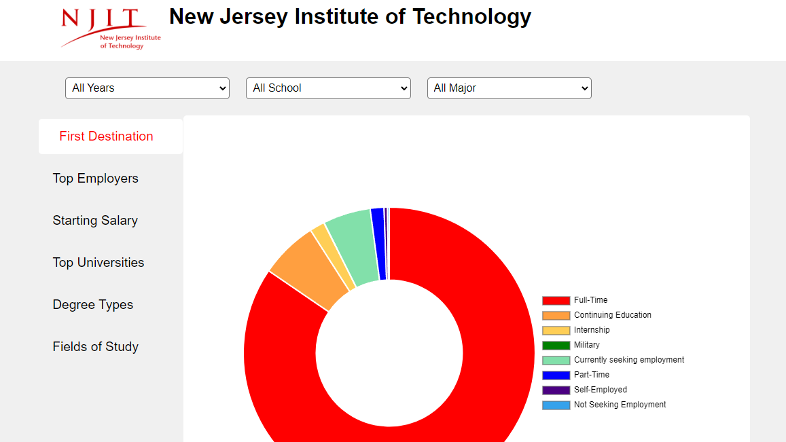

# Graduate Student Outcomes Dashboard

Welcome to the Graduate Student Outcomes Dashboard! This application is designed to showcase the post-graduation outcomes of graduate students, providing valuable insights into employment trends, starting salaries, top employers, higher education pursuits, and more. By using various filters, users can analyze specific trends based on graduation year, school, and major.



## Key Features

- **Employment Trends**: Visualize student employment trends over time.
- **Starting Salaries**: Display starting salaries of graduates.
- **Top Employers**: Highlight top employers hiring graduates.
- **Higher Education**: Showcase top universities, fields of study, and degree types for graduates pursuing further education.
- **Interactive Filters**: Filter data by graduation year, school, and major to analyze specific trends.
- **Graphs and Charts**: Utilize graphs and pie charts for better data visualization.
- **Automated Reporting**: Automate the manual process of report-making, making it easier to analyze and compare trends.

## Technologies Used

- **HTML**: Structure of web pages.
- **CSS**: Styling the application.
- **JavaScript (JS)**: Functionality and interactivity.
- **Node.js**: Backend runtime environment.
- **Express.js**: Web application framework.
- **Chart.js**: For creating dynamic and interactive charts.
- **PostgreSQL**: Database for storing and managing data.

## Getting Started

Follow these steps to set up the Graduate Student Outcomes Dashboard on your local machine.

### Prerequisites

- Node.js (v12.x or later)
- npm (v6.x or later)
- PostgreSQL

### Installation

1. Clone the repository:
    ```bash
    git clone https://github.com/YourUsername/GraduateOutcomesDashboard.git
    ```
2. Navigate to the project directory:
    ```bash
    cd GraduateOutcomesDashboard
    ```
3. Install the dependencies:
    ```bash
    npm install
    ```
4. Set up the PostgreSQL database and configure the connection in the `.env` file.
5. Start the application:
    ```bash
    npm start
    ```
6. Open your browser and navigate to `http://localhost:3000`.

## Usage

- **Filter Data**: Use the provided filters to view specific data trends.
- **Visualize Data**: Analyze the trends using graphs and charts.
- **Export Reports**: Generate and download reports for further analysis.

## Contributing

Contributions are welcome! If you have suggestions or improvements, please create an issue or submit a pull request.

1. Fork the repository.
2. Create your feature branch:
    ```bash
    git checkout -b feature/AmazingFeature
    ```
3. Commit your changes:
    ```bash
    git commit -m 'Add some AmazingFeature'
    ```
4. Push to the branch:
    ```bash
    git push origin feature/AmazingFeature
    ```
5. Open a pull request.

## License

This project is licensed under the **Dashboard Software License Agreement** for NJIT CDS. See the [LICENSE](LICENSE) file for details.

## Contact

For inquiries regarding this project, please contact NJIT CDS:

- GitHub: [YourUsername](https://github.com/YourUsername)

---

Thank you for using the Graduate Student Outcomes Dashboard! We hope it provides valuable insights and simplifies your reporting process.
